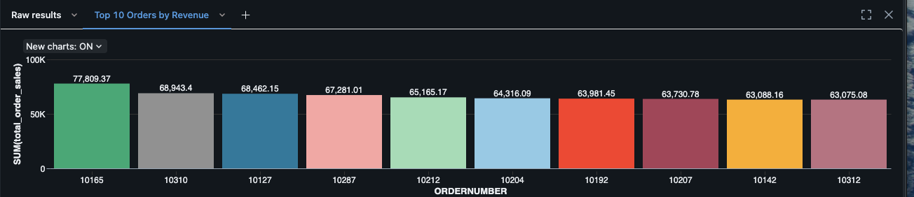

# 📊 GlobalMart Sales Dashboard — Databricks BI Project

This project analyzes sales data from **GlobalMart**, a retail company seeking to improve data-driven decision-making. The goal is to build an interactive dashboard that provides insights into total revenue, order volume, sales trends, and top-performing orders using **Databricks SQL and visualization tools**.

---

## 🧰 Task 1: Setting up the Databricks Environment

This step involved preparing the environment for data analysis in Databricks Community Edition.

### ✅ Steps Completed:

- ✔️ Accessed Databricks Community Edition (free cloud workspace)
- ✔️ Created a new **SQL notebook**
- ✔️ Created and started the default **Community cluster**
- ✔️ Uploaded the file: `sales_data_sample.csv`
- ✔️ Created a table named `sales_data_sample` using the UI (Data → Create Table)

### 🔍 Preview the data
```sql
SELECT * FROM sales_data_sample LIMIT 10;
```
---

## 🧹 Task 2: Exploring and Cleaning the Data
```sql
DESCRIBE TABLE sales_data_sample;
```
---

## ✅  Check for Missing Values
```sql
SELECT 
  COUNT(*) AS total_rows,
  COUNT(ORDERNUMBER) AS ordernumber_count,
  COUNT(QUANTITYORDERED) AS quantity_count,
  COUNT(PRICEEACH) AS price_count,
  COUNT(SALES) AS sales_count,
  COUNT(ORDERDATE) AS orderdate_count
FROM sales_data_sample;
```
---

## ✅ Check for Duplicates
```sql
SELECT ORDERNUMBER, ORDERLINENUMBER, COUNT(*) AS duplicate_count
FROM sales_data_sample
GROUP BY ORDERNUMBER, ORDERLINENUMBER
HAVING COUNT(*) > 1;
```
---

## ✅  Convert ORDERDATE from string to date

```sql
CREATE OR REPLACE TEMP VIEW cleaned_sales AS
SELECT *,
       TO_DATE(ORDERDATE, 'M/d/yyyy H:mm') AS order_date_parsed
FROM sales_data_sample;
```
---

## ✅  Basic Statistics

```sql
SELECT
  MIN(SALES) AS min_sales,
  MAX(SALES) AS max_sales,
  AVG(SALES) AS avg_sales,
  COUNT(*) AS total_records
FROM sales_data_sample;
```
---

## 📈 Task 3: Identifying Key Sales Metrics
```sql
SELECT ROUND(SUM(SALES), 2) AS total_revenue
FROM sales_data_sample;
```
---

## 💰 Total Revenue
```sql
SELECT ROUND(SUM(SALES), 2) AS total_revenue
FROM sales_data_sample;
```
---

## 📦 Number of Unique Orders
```sql
SELECT COUNT(DISTINCT ORDERNUMBER) AS total_orders
FROM sales_data_sample;
```
---

## 💳 Average Order Value (AOV)
```sql
SELECT ROUND(SUM(SALES) / COUNT(DISTINCT ORDERNUMBER), 2) AS avg_order_value
FROM sales_data_sample;
```
---

## 🔝 Top 10 Orders by Sales
```sql
SELECT ORDERNUMBER, SUM(SALES) AS total_order_sales
FROM sales_data_sample
GROUP BY ORDERNUMBER
ORDER BY total_order_sales DESC
LIMIT 10;
```
---

## 📊 Monthly Sales Trend
```sql
SELECT 
  DATE_FORMAT(order_date_parsed, 'yyyy-MM') AS month,
  ROUND(SUM(SALES)) AS monthly_sales
FROM cleaned_sales
GROUP BY month
ORDER BY month;
```
---

## 📊 Task 4: Creating Visualizations and Dashboard in Databricks

To bring insights to life, I created visualizations directly in Databricks using the built-in dashboard interface. Each visualization is based on a SQL query and represents a key sales metric.

### ✅ Visualizations Created:

| Metric                        | Visualization Type | Description                                 |
|------------------------------|--------------------|---------------------------------------------|
| 💰 Total Sales Revenue       | KPI                | Displays total revenue using `SUM(SALES)`   |
| 📦 Number of Orders          | KPI                | Count of unique orders                      |
| 💳 Average Order Value (AOV) | KPI                | Total revenue divided by number of orders   |
| 🔝 Top 10 Orders by Revenue  | Bar Chart          | Highest grossing orders sorted descending   |
| 📈 Monthly Sales Trend       | Line Chart         | Shows how revenue evolved over time         |

### 📎 💰 Total Sales Revenue   
```sql
SELECT ROUND(SUM(SALES)) AS total_revenue
FROM sales_data_sample; 
```


---

### 🧾 Number of Unique Orders (KPI)
```sql
SELECT COUNT(DISTINCT ORDERNUMBER) AS total_orders
FROM sales_data_sample; 
```


---

### 💳 Average Order Value (AOV)
```sql
SELECT 
  ROUND(SUM(SALES) / COUNT(DISTINCT ORDERNUMBER), 2) AS avg_order_value
FROM sales_data_sample; 
```


---

### 🔝 Top 10 Orders by Revenue
```sql
SELECT ORDERNUMBER, ROUND(SUM(SALES), 2) AS total_order_sales
FROM sales_data_sample
GROUP BY ORDERNUMBER
ORDER BY total_order_sales DESC
LIMIT 10;
```



### 📈 Monthly Sales Trend
```sql
SELECT 
  DATE_TRUNC('MONTH', TO_DATE(ORDERDATE, 'M/d/yyyy H:mm')) AS month_date,
  ROUND(SUM(SALES), 2) AS monthly_sales
FROM sales_data_sample
GROUP BY month_date
ORDER BY month_date;
```
 

- Sharp increases are noticeable around **October 2003** and **October 2004**, indicating seasonal peaks.


